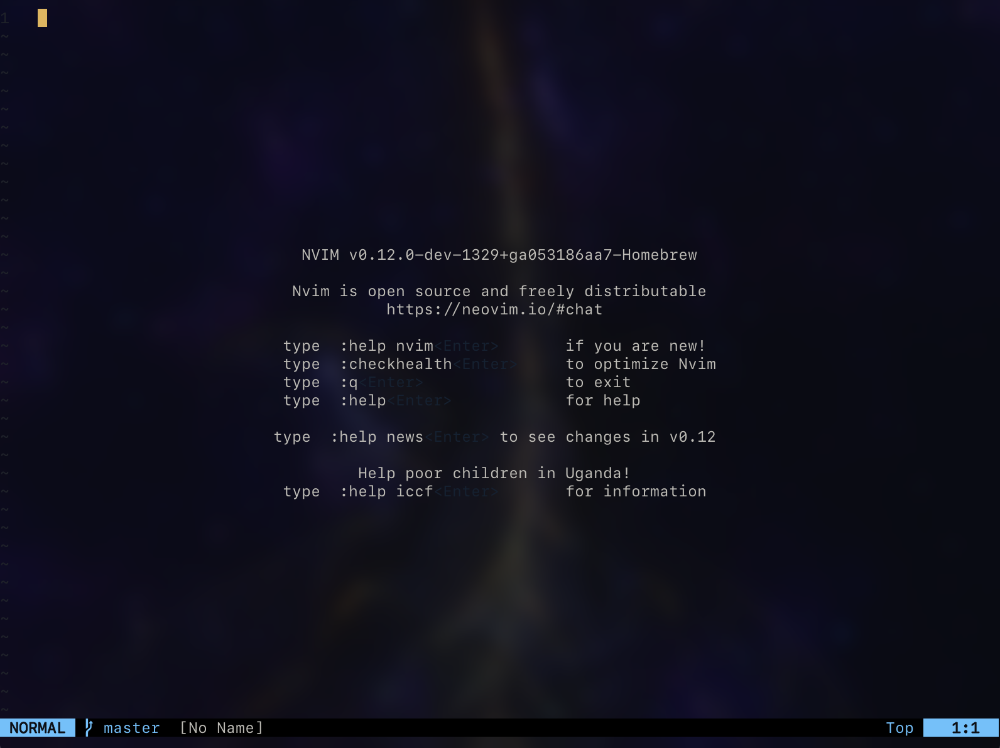
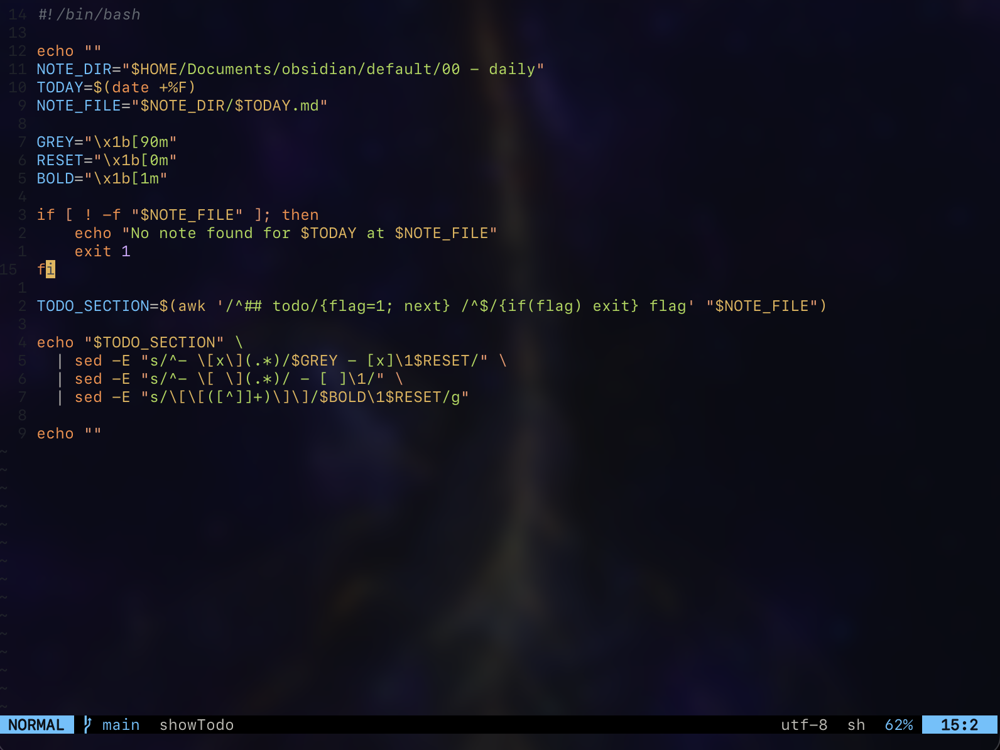

  <h1>neovim <i>riced up</i></h1>
   
  

    
    
  

   
  
uses <b>pack</b> (only available on v12+)

## what's this?

a minimal Neovim config that looks good and feels snappy. no bloat, just the essentials to edit code fast.

## Features

- **ayu theme** for those warm vibes
- transparent background (so your wallpaper shines through)
- lualine statusline with git branch + status
- super easy file and buffer picker (mini.pick)
- oil.nvim for a slick file explorer
- git integration (fugitive + gitsigns)
- comment.nvim for quick code commenting
- keymaps for fast writing, quitting, and git stuff
- All config in one file (`init.lua`)

## keymaps

- `<leader>` is **SPACE**

- `<leader>w` - Save
- `<leader>q` - Quit
- `<leader>Q` - Force quit
- `<leader>f` - Pick files
- `<leader>b` - Pick buffers
- `<leader>e` - Open Oil file explorer
- `<leader>gs` - Git status
- `<leader>ga` - Git add current file
- `<leader>gu` - Git restore staged
- `<leader>gc` - Git commit
- `<leader>gd` - Git diff split
- `<leader>gb` - Git blame
- `<leader>gp` - Git push
- `<leader>gP` - Git pull
- `<leader>/` - Toggle comment (normal/visual)
- `` <leader>` `` - Open terminal below

## plugins

- [ayu](https://github.com/Shatur/neovim-ayu)
- [mini.pick](https://github.com/echasnovski/mini.pick)
- [oil.nvim](https://github.com/stevearc/oil.nvim)
- [Comment.nvim](https://github.com/numToStr/Comment.nvim)
- [vim-fugitive](https://github.com/tpope/vim-fugitive)
- [gitsigns.nvim](https://github.com/lewis6991/gitsigns.nvim)
- [lualine.nvim](https://github.com/nvim-lualine/lualine.nvim)
- [transparent.nvim](https://github.com/xiyaowong/transparent.nvim)

## setup

1. Make sure you're on Neovim v12+ (for pack)
2. Clone this repo into your `~/.config/nvim`
3. Open Neovim and let pack do its thing
4. Enjoy your riced up editor!
